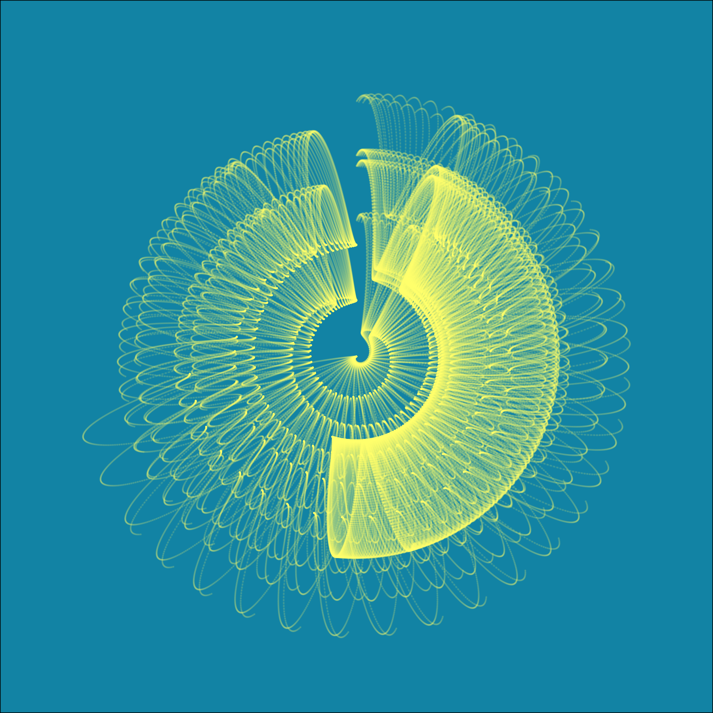

### Hey there

- I am currently working at [Vijay's Lab](https://github.com/vijaybioinfo) investigating the immune system in the context of diseases like cancer, asthma, and viral infections.
- My research interests include:
  + Computational modelling
  + Bioinformatics and software development
  + Gene regulation
  + Single-cell multi-omics
  + Generative art
  
- I am currently looking for a PhD Programme where I can expand and develop further my skills and the above interests.

## Contact

Please feel free to contact me to ciro@lji.org or ksuasteguic@gmail.com.

 

## Languages+

  

## What I like to listen to 🎧

#### Twitter's trend:

| Unfollowed me |  Followed me |
| --- | --- |
Fri Jan 10 20:14:56 UTC 2025
